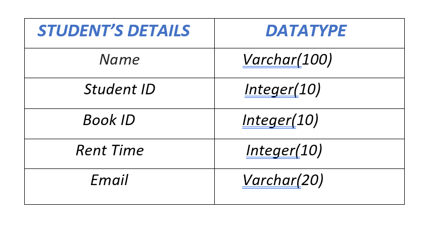
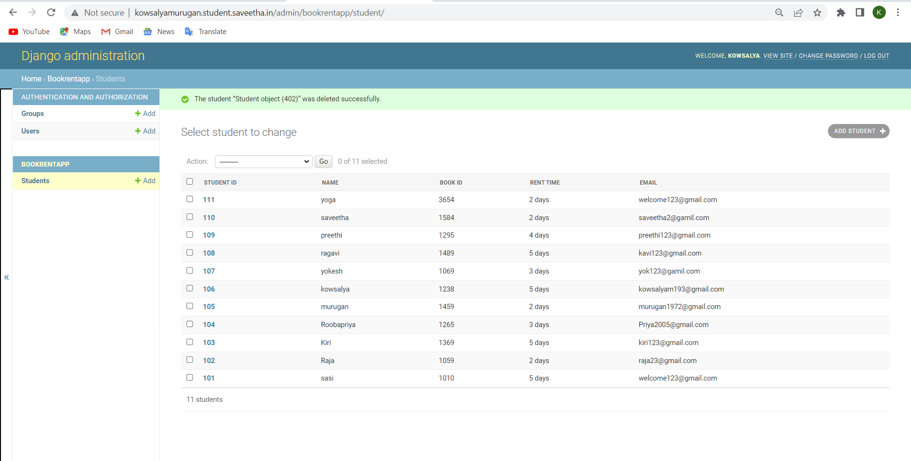

# Django ORM Web Application

## AIM
To develop a Django application to store and retrieve data from a database using Object Relational Mapping(ORM).

## Entity Relationship Diagram:



## DESIGN STEPS:

### STEP 1:
Create a new Django project using "django-admin startproject",get into the project's terminal and use "python3 manage.py startapp" command.

### STEP 2:
Define a model for the librarymembership in the models.py and allow host access and add the app name under the installed apps in settings.py

### STEP 3:
Register the models with the Django admin site. In admin.py under app folder, register the models with Django admin site.

## PROGRAM
```
#IN models.py:-

from django.db import models
from django.contrib import admin
# Create your models here.
class Student(models.Model):
    student_id = models.CharField(max_length=8,primary_key=True)
    name = models.CharField(max_length=100)
    book_id = models.IntegerField()
    rent_time = models.CharField(max_length=100)
    email = models.EmailField()

class StudentAdmin(admin.ModelAdmin):
    list_display = ('student_id','name','book_id','rent_time','email')

#IN admin.py:-

from django.contrib import admin
from .models import Student,StudentAdmin

# Register your models here.
admin.site.register(Student,StudentAdmin)

```

## OUTPUT:



## RESULT:
Thus a Django application to store and retrieve data from a database using Object Relational Mapping(ORM) is developed.